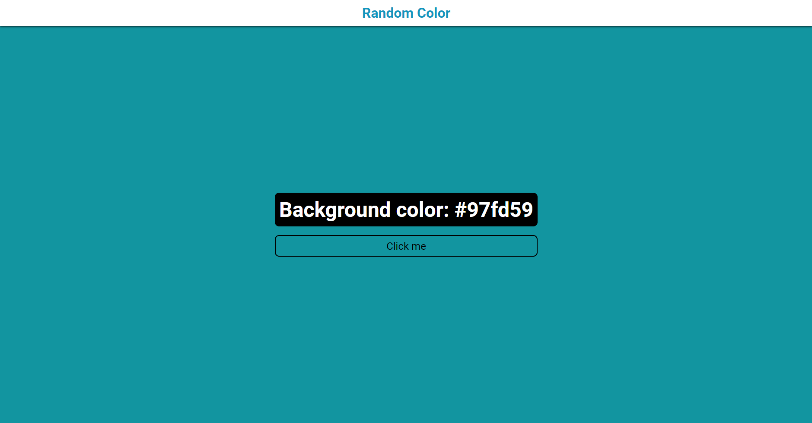

## 💻 Projeto

Pagina criada no intuito de melhorar meu conhecimento com Javascript.

## 🚀 Tecnologias

- [HTML](https://developer.mozilla.org/pt-BR/docs/Web/HTML)
- [CSS](https://developer.mozilla.org/pt-BR/docs/Web/CSS)
- [JS](https://developer.mozilla.org/pt-BR/docs/Web/JavaScript)

## 📝 Critério

- [ ] Utilizar <b>function()</b> para gerar as cores aleatórias.
- [ ] Mostrar a cor gerada no background da pagina.
- [ ] Mostrar o hexadecimal da cor gerada na pagina.

[Link da pagina](https://clintonrocha98.github.io/Color-pag/)

  
</img>
